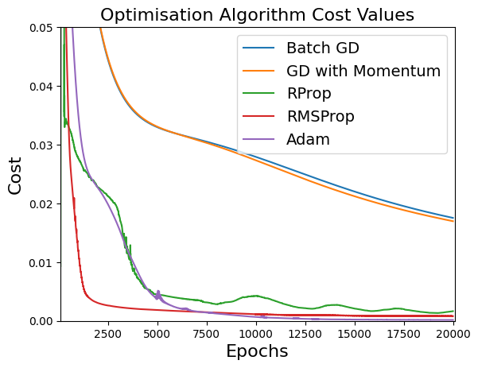

# Neural Networks for Solving Differential Equations

An exploration into artificial neural networks and how they can be applied to the study of differential equations.

## Project Overview

This project was undertaken as a dissertation for a Master's programme in Mathematics at Durham University (Oct. 2022 - Apr. 2023), where it attained a final grade of 85%. The report will be comprehensible for anyone with a solid grounding in undergraduate maths and Python programming; no prior knowledge of neural networks, PyTorch or numerical solutions to differential equations are required. An overview of the report structure is given below.

### Abstract

Finding numerical solutions to differential equations is crucial to many scientific disciplines. In the 1990s, a new method was proposed which utilises neural networks to approximate the solution function of a differential equation. In this dissertation, we explore the efficacy of this method in a variety of different examples. We also examine the effect of varying different aspects of our neural network’s structure and training methodology. Finally, we consider a recent extension of the original method, and another technique by which neural networks can be used to estimate unknown parameters in a differential equation.

### Chapter 1: Introduction

We give a brief summary of the histories of both artificial neural networks and differential equations, and a hint at how the two were combined by the Lagaris method in the 1990s. We then outline the structure of the rest of the report.

### Chapter 2: Neural Networks

We begin by understanding some basic notions in the study of neural networks, with our desired applications in mind. We see the fundamental components that make up a neural network, and a common method of training them. Then, we explore automatic differentiation, the computational technique behind a crucial part of their training: the backpropagation algorithm.
> 
> A fully-connected, feedforward neural network with *n* inputs, *k* outputs and five hidden layers each made up of *m* nodes.

### Chapter 3: Function Approximation

We explain why neural networks are suited to the task of function approximation, and then give an introduction to PyTorch, the machine learning library used throughout this project. We demonstrate a basic example of using a neural network in PyTorch to approximate sin(x).
> 
> The Universal Approximation Theorem: neural networks can approximate any continuous function to arbitrary accuracy (on compact domains). Note that versions of the theorem also exist for other classes of functions.

### Chapter 4: Optimisation Algorithms

In chapter 2 the basic batch gradient descent algorithm for training a neural network was explained. Here, we explore in detail a variety of gradient-based optimisation algorithms designed to perform better than batch gradient descent, and compare their strengths and limitations. 
>   
> Smoothing effect of momentum on gradient descent. Movement is dampened along parameter axes where gradients fluctuate more, while progress is unchanged for parameters with more constant gradients (image taken from <a href="https://towardsdatascience.com/gradient-descent-explained-9b953fc0d2c">towardsdatascience.com/gradient-descent</a>).

### Chapter 5: Application to Differential Equations

We outline the Lagaris method for solving differential equations using neural networks, which differs greatly from traditional (finite-difference) approaches for solving differential equations numerically. We then apply this to a few different examples (ODEs of various orders, systems of ODEs, linear and non-linear PDEs) to illustrate its efficacy and stumbling blocks. Simultaneously, we test the effect of varying the aspects of our training methodology discussed in chapters 2 and 4, and encounter an effective method known as curriculum learning. The code corresponding to these examples can be found in the **LagarisProblems** folder.
>    
> Left: Output of a neural network trained with Adam optimisation algorithm to solve example 2 from the Lagaris paper for 20,000 epochs, compared to the true solution.
> 
> Right: Training cost values for five different optimisation algorithms to solve example 2 from the Lagaris paper for 20,000 epochs. The graph’s key is ordered from highest final cost to lowest.

### Chapter 6: Solution Bundles

We consider a powerful extension of the Lagaris method, proposed in 2020, in which a neural network is trained to approximate the solution of a given differential equation on a *range of initial conditions*. We see the alterations this necessitates in our method, including the use of a GPU, and use a restricted version of the famous three-body problem to illustrate the method. We compare various modes of curriculum learning and observe its limitations. Finally, we give an overview of how this extended version of the Lagaris method compares to traditional finite-difference methods. The **ThreeBodyProblem** folder contains code for this chapter. 
>    
> Left: Output of neural network trained to solve the planar circular restricted three-body problem on a bundle of initial conditions, compared to the 4th-order Runge-Kutta solution. The Earth and the moon are shown in blue and orange.
>
> Right: Training cost values of this network, trained on 3,000,000 batches of 10,000 inputs. The use of a learning rate scheduler during training leads to the sequence of "steps" observed in the cost graph.

### Chapter 7: Parameter Inference

A different application of neural networks to the field of differential equations (developed in 2017) is explored, in which unknown parameters in a differential equation can be estimated based on sample data values of the solution function. We use an example from fluid mechanics, Burger's equation, to demonstrate the method and compare some variations of its implementation. Code for this chapter can be found in the **burgersEquation** folder. 
>    
> Left: Output of a neural network trained to approximate the solution to Burger’s equation for 100,000 epochs.
>
> Right: Neural network’s estimation of Burger’s equation parameter values λ and ν throughout training.

### Chapter 8: Conclusion

We conclude with a discussion of the scope of this paper, and indications for areas of future development which we have not explored.

### Appendix A: Xavier Weight Initialisation

We give a detailed explanation of the mathematics underlying a popular weight-initialisation method described in chapter 2: Xavier initialisation.

### Appendix B: Finite-Difference Methods

We give a brief summary of the two finite-difference methods for solving ordinary differential equations mentioned in this paper: the Euler method and the fourth-order Runge-Kutta method.

### Appendix C: Code Samples

Samples of the most relevant code referenced in the paper are included here.

### Bibliography

All sources used are cited here. See below for the resources I found most important and useful.

## Repository Contents
* **Graphs:** Images and graphs included in the final report.
* **LagarisProblems:** Code to solve the first eight examples given in the Lagaris paper (chapter 5).
* **OldVersions:** Draft versions of code included in other folders.
* **ThreeBodyProblem:** Code to approximate solution bundles to the planar circular restricted three-body problem (chapter 6).
* **burgersEquations:** Code to approximate the solution to Burger's equation and estimate the equation's unknown parameters (chapter 7).
* **pthFiles:** Trained networks' parameter values stored in pth files.
* **FinalReport:** Final dissertation submitted, 55 pages plus appendices.

## Packages Used
* PyTorch Version 1.12.1
* NumPy Version 1.23.5
* Matplotlib Version 3.6.0
* SciPy Version 1.9.1

## Key Sources
### Neural Networks:
Michael A. Nielsen. Neural Networks and Deep Learning. Determination Press, 2018. url: http://neuralnetworksanddeeplearning.com.

Ian Goodfellow, Yoshua Bengio, and Aaron Courville. Deep Learning. MIT Press, 2016. url: http://www.deeplearningbook.org.

### Automatic Differentiation:
Atilim Gunes Baydin, Barak A. Pearlmutter, and Alexey Andreyevich Radul. “Automatic differentiation in machine learning: a survey”. In: CoRR abs/1502.05767 (2015). arXiv:1502.05767. url: http://arxiv.org/abs/1502.05767.

### The Universal Approximation Theorem:
Moshe Leshno et al. “Multilayer feedforward networks with a nonpolynomial activation function can approximate any function”. In: Neural Networks 6.6 (1993), pp. 861–867. issn: 0893-6080. doi: https://doi.org/10.1016/S0893-6080(05)80131-5. url: https://www.sciencedirect.com/science/article/pii/S0893608005801315.

### The Lagaris Method:
I.E. Lagaris, A. Likas, and D.I. Fotiadis. “Artificial neural networks for solving ordinary and partial differential equations”. In: IEEE Transactions on Neural Networks 9.5 (1998), pp. 987– 1000. doi: 10.1109/72.712178. url: https://arxiv.org/abs/physics/9705023.

### Curriculum Learning:
Guy Hacohen and Daphna Weinshall. “On the power of curriculum learning in training deep networks”. In: International Conference on Machine Learning (2019), pp. 2535–2544.

### Solution Bundles:
Cedric Flamant, Pavlos Protopapas, and David Sondak. “Solving Differential Equations Using Neural Network Solution Bundles”. In: CoRR abs/2006.14372 (2020). arXiv: 2006 . 14372. url: https://arxiv.org/abs/2006.14372.

### Parameter Inference:
Maziar Raissi, Paris Perdikaris, and George E. Karniadakis. “Physics Informed Deep Learning (Part II): Data-driven Discovery of Nonlinear Partial Differential Equations”. In: CoRR abs/1711.10566 (2017). arXiv: 1711.10566. url: http://arxiv.org/abs/1711.10566.
